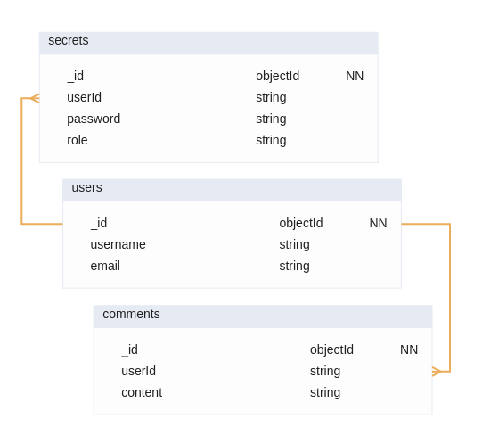

# MERN Web-App

This is a Web-App using the MERN stack:

- (M) MongoDB NoSql database
- (E) Express.js backend framework
- (R) React frontend framework
- (N) Node.js backend environment

---

## Table of Contents

- [Running locally (with Docker)](#running-locally-with-docker)
- [Running locally by hand](#running-locally-by-hand)
- [Database structure](#database-structure)
- [Main features](#main-features)
- [Used technologies](#used-technologies)
- [License](#license)

## Running locally (with Docker)

> Requires [Docker](https://www.docker.com/) and [Docker Compose](https://docs.docker.com/compose/)

```bash
git clone https://github.com/pavelgusev431/ND_3.git
cd ND_3
docker-compose up --build
```

- Frontend: [http://localhost:3000](https://localhost:3000)
- Backend: [http://localhost:5000](https://localhost:5000)
- Database: [http://localhost:27017](https://localhost:27017)

## Running locally (by hand)

First download the repo:

```bash
git clone https://github.com/pavelgusev431/ND_3.git
cd ND_3
```

Then run the MongoDB database (mongod CLI or Docker image);

Create a collection called "Comments";

Open up two teminals and in the first run:

```bash
cd server
npm install
npm run start
```

If you see any errors - go to the .env file in the server directory and change the PORT variable to something else that is currently unused by your system.

In your second terminal run this:

```bash
cd client
npm install
npm run start
```

Now you can access the frontend: [http://localhost:5173](http://localhost:5173).

>Note: if you have changed the PORT variable in the server's .env file - also change it in the client's .env file. The variable name there will be "VITE_API_URL".

## Database structure

> Database is made up of 3 collections:
>
> - users
> - secrets (for sensitive user data)
> - comments (the main data of the app)



[Here is the database json file](./db.json).

## Main features

You can perform basic CRUD operations, such as:

- Create a new user account;
- Create a new comment;
- See all comments of all users (including your own);
- Edit your comments;
- Delete your comments;

The app uses these security methods for user authentication:

- Multiple password hashing;
- Cryptographic salt on passwords;
- Storing only the password hashes in the database;
- JWT tokens to allow access to protected routes;
- /me route to allow reconnects if you accidentally closed the page but still have the token in your browser;
- Frontend route protection, which always checks for a JWT token cookie;
- Backend route protection, which decodes your JWT token for sensitive operations, allowing you to only edit and delete your own comments;

Requests from the frontend are performed via axios using the dedicated [helpers](./client/src/helpers/). The frontend components are either part of the main [layout](./client/src/components/layout/) or are [protected](./client/src/components/protected/). The frontend uses React's Context to store information about the user.

The backend has its own Error Handler middleware (can be found [here](./server/middlewares/errorHandler.js)). Both routes (users, comments) have their dedicated [routers](./server/routers/), which use the functions written in [controllers](./server/controllers/) to perform the tasks required by the requests. Controllers perform functions using [models](./server/models/) that are created with mongoose, which connects to the MongoDB database [here](./server/database/mongoose.js). The backend is protected from outside access using the CORS policy in the [app](./server/server/app.js) during the server's setup. Every time the server is ran - it auto-regenerates the JWT Secret in the .env file to keep it fresh and new.

## Used technologies

- MERN
- Tailwind
- Axios
- JsonWebToken
- Mongoose
- cors
- nanoid, js-sha1, js-sha256, js-cookie, cookie-parser (for encryption and token checking)
- dotenv, eslint and prettier for code structure and quality

## License

This project is under the [MIT license](./LICENSE).
